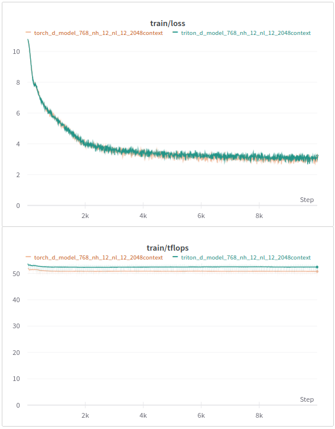

# Tritonformer

A GPT2-style transformer in Triton. Differentiable with forward + backward speeds matching that of a PyTorch transformer using cuBLAS kernels and [flash-attention](https://pytorch.org/docs/stable/generated/torch.nn.functional.scaled_dot_product_attention.html).

Supports Autograd and Automatic Mixed Precision.

## Kernels

Triton kernels definitions are located under `tritonformer/kernels`. Autograd functions wrapping kernels are located under `tritonformer`.

Kernels implemented:

### Attention

- Fused Attention `kernels/attention.py`

- Fused Attention w/ ALiBi `kernels/biased_attention.py`

### GEMM

- MatMul: `(b,m,n) @ (n,k) -> (b,m,k)` `kernels/gemm.py`
- Fused MatMul + ReLU: `(b,m,n) @ (n,k) -> (b,m,k)` `kernels/gemm.py`
- Fused MatMul + Add: `(b,m,n) @ (n,k)-> (b,m,k) + (k,)` `kernels/gemm.py`
- Fused MatMul + Add + ReLU: `(b,m,n) @ (n,k)-> (b,m,k) + (k,)` `kernels/gemm.py`
- Batched MatMul: `(b,m,n) @ (b,n,k) -> (b,m,k)` `kernels/gemm.py`

### Losses

- CrossEntropy `kernels/crossentropy.py`

### Activations/Normalization

- LayerNorm `kernels/layernorm.py`
- Softmax `kernels/softmax.py`

## Use

Clone repo and install requirements:

```bash
git clone https://github.com/fattorib/tritonformer.git
pip install -r requirements.txt
pip install -U --index-url https://aiinfra.pkgs.visualstudio.com/PublicPackages/_packaging/Triton-Nightly/pypi/simple/ triton-nightly==2.1.0.dev20231014192330
```

PyTorch transformer models using Triton and cuBLAS kernels are provided under `transformer_triton.py` and `transformer_torch.py`. For example to use the model with Triton kernels, add:

```python
...
from transformer_triton import Transformer, TransformerConfig
config = TransformerConfig(...) # create config
model = Transformer(config) # create model
...
```

Train like you would any other model!

## Benchmarks

Benchmark code is quite simple:

```python
# imports and instantiate model
...
start = torch.cuda.Event(enable_timing=True)
end = torch.cuda.Event(enable_timing=True)
start.record()
for step in range(100):
  with torch.cuda.amp.autocast():
    logits, loss = model(batch, batch)
  loss.backward()

torch.cuda.synchronize()
end.record()
time_s = start.elapsed_time(end) / 1e3
# convert time_s to TFLOPs
```

**Setup**: Benchmarks are performed on an RTX 3090 with `torch==2.0.0` and `triton-nightly==2.1.0.dev20231014192330`. Flash Attention from PyTorch is enabled with the ```torch.backends.cuda.sdp_kernel``` context manager.

| Model Size | Context | Tritonformer (TFLOPs) | PyTorch (TFLOPs) | Config                                               |
|------------|---------|-----------------------|------------------|------------------------------------------------------|
| 410M       | 2048    | 50.1719               | 50.2183          | `bs=4`,`use_linear_bias = False`,`attn_bias = False` |
| 410M       | 4096    | 42.2310               | 45.5872          | `bs=2`,`use_linear_bias = False`,`attn_bias = False` |
| 840M       | 2048    | 52.6596               | 52.2332          | `bs=2`,`use_linear_bias = False`,`attn_bias = False` |
| 840M       | 4096    | 45.8857               | 48.4785          | `bs=1`,`use_linear_bias = False`,`attn_bias = False` |
| 1.4B       | 2048    | 55.6311               | 55.8419          | `bs=2`,`use_linear_bias = False`,`attn_bias = False` |

## Sample Loss Curves

On a small 160M parameter model, end-to-end training[^1] with Tritonformer achieves pairity with the equivalent PyTorch model:



## Tests

Tests are handled by [PyTest](https://docs.pytest.org/en/7.4.x/). Run `pytest tritonformer/` to run all tests. **Note:** There are a lot of tests so running them all can take a while!

## Acknowledgments

- Parts of the PyTorch transformer code were originally based off of [`zphang/minimal-opt`](https://github.com/zphang/minimal-opt)

- Some earlier forward-pass kernels were written as I followed along through the [Triton Tutorials](https://triton-lang.org/main/getting-started/tutorials/index.html)

[^1]: **Run parameters**: Dataset: MiniPile, Context: 2048 Tokens (Neox Tokenizer), Batch Size: 64, FP16 Autocast Enabled, RTX 3090
